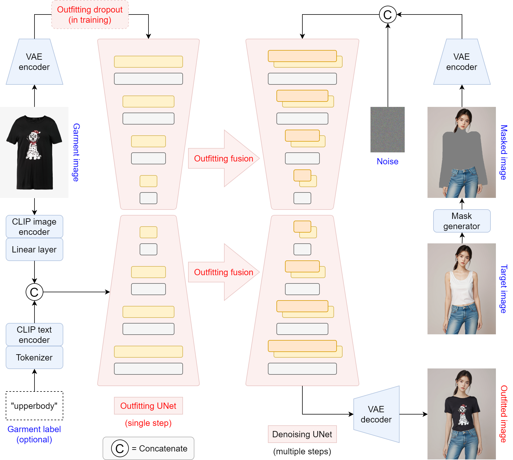
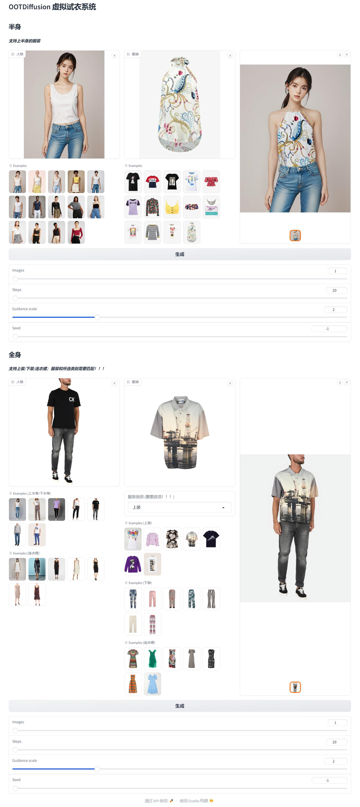

# OOTDiffusion

官方代码库：[https://github.com/levihsu/OOTDiffusion](https://github.com/levihsu/OOTDiffusion)

推荐使用 RTX 3090 及以上的 GPU 部署




## Installation

1. 克隆代码库

```sh
git clone https://github.com/Marquis03/OOTDiffusion
```

2. 创建 conda 环境并安装所需库

```sh
conda create -n ootd python==3.10
conda activate ootd
pip install -r requirements.txt
```

## Download Checkpoints

1. 安装 modelscope

```sh
pip install modelscope
```

2. 下载模型预训练权重

```sh
python download.py
```

3. 将下载好的权重文件移动到 checkpoints 文件夹下

```text
checkpoints
├─ ootd
├─ humanparsing
├─ openpose
└─ clip-vit-large-patch14
```

## Inference

1. 半身

```sh
cd OOTDiffusion/run
python run_ootd.py --model_path <人物图像路径> --cloth_path <服装图像路径>
```

2. 全身

> 服装与类别必须匹配：0 = 上装；1 = 下装；2 = 连衣裙

```sh
cd OOTDiffusion/run
python run_ootd.py --model_path <人物图像路径> --cloth_path <服装图像路径> --model_type dc --category 2
```

## WebUI

```sh
cd OOTDiffusion/run
python gradio_ootd.py
```



## Star History

[](https://star-history.com/#Marquis03/OOTDiffusion&Date)
